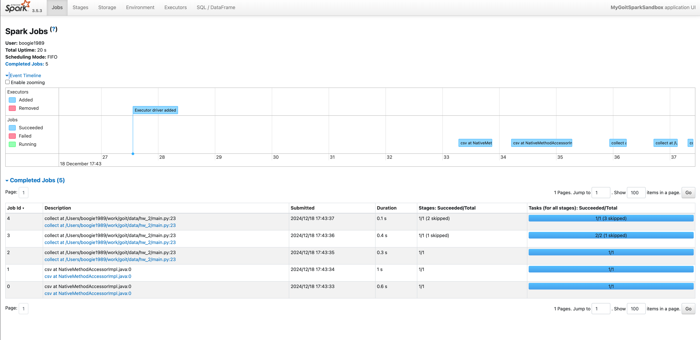
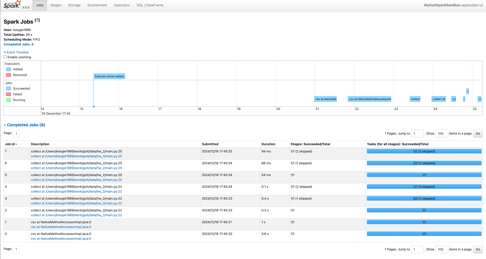
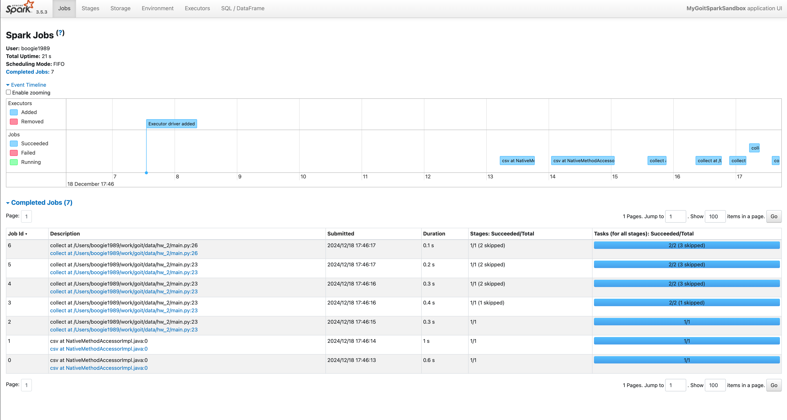

---

### Screenshot_1 (5 Jobs) 

In this scenario, we performed a series of operations on the DataFrame and executed a single final action (`collect()`), resulting in 5 Jobs.

**Job #0:**  
- Involves reading data from the CSV file (64 KiB read).
- Contains tasks like scanning the text file, applying WholeStageCodegen optimizations, and running `mapPartitionsInternal`.
  
**Job #1:**  
- Reads 453.2 KiB of data from the CSV.
- Includes similar tasks as Job #0 (file scan, WholeStageCodegen, `mapPartitionsInternal`), plus additional steps like `DeserializeToObject` and `SQLExecutionRDD` to handle deserialization and SQL execution.

**Job #2:**  
- Introduces the first data exchange operation (a shuffle) due to the grouping or filtering stage.
- Tasks: file scan from CSV, WholeStageCodegen, and an `Exchange` node to redistribute data across the cluster.

**Job #3:**  
- Also triggers data exchanges and introduces a second shuffle.
- Some tasks are skipped (already computed in previous stages), leaving essential tasks such as `Exchange` and another WholeStageCodegen stage to finalize certain transformations.

**Job #4:**  
- Completes the final aggregation and filtering steps.
- Previous stages’ computations are reused, resulting in some skipped tasks.
- The main tasks here include `AQEShuffleRead` (Adaptive Query Execution shuffle read), WholeStageCodegen, and `mapPartitionsInternal` to produce the final result.

---

### Screenshot_2 (8 Jobs) 

In this run, an extra `collect()` action is inserted in the middle of the processing chain. This additional `collect()` causes Spark to execute more transformations earlier, increasing the total number of Jobs to 8.

**Key Difference:**  
- The intermediate `collect()` action forces Spark to materialize intermediate results earlier than in the previous scenario.
- Each `collect()` action may involve multiple stages (such as reading, shuffling, and final aggregation) that, when repeated, generate additional Jobs.
- The added three Jobs compared to the previous run come from performing transformations and shuffles twice—once before the intermediate `collect()` and then again before the final `collect()`.

---

### Screenshot_3 (7 Jobs) 

In this scenario, we added a `cache()` operation before running the actions. Caching stores the results of certain transformations in memory, allowing subsequent actions on the same data to reuse results without re-reading or recomputing previous steps. This reduces the overall number of Jobs to 7.

**Key Difference:**  
- The cached DataFrame does not need to re-perform all previous computations for each action.
- As a result, fewer Jobs are triggered after caching since Spark can skip expensive stages (such as re-reading from CSV or re-shuffling data).
- The 7 Jobs reflect that the initial computations are done once and then reused, avoiding the extra Jobs seen in the second scenario.

---

**In Summary:**  
- **Screenshot_1:** A single sequence of transformations and a final collect leads to 5 Jobs.  
- **Screenshot_2:** An extra intermediate `collect()` increases the number of Jobs to 8 due to repeated computations.  
- **Screenshot_3:** Using `cache()` reduces redundant work and lowers the count to 7 Jobs, even with multiple actions.